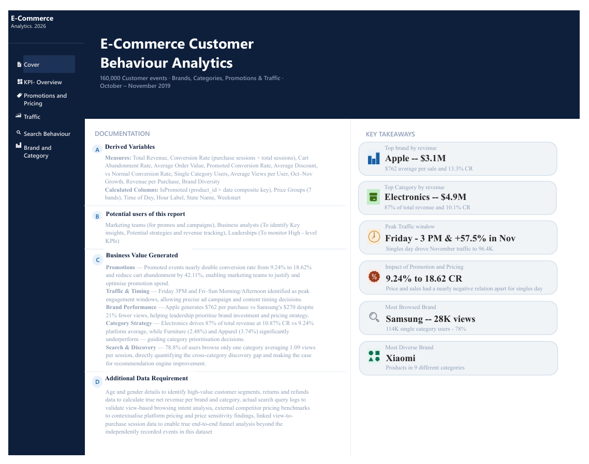
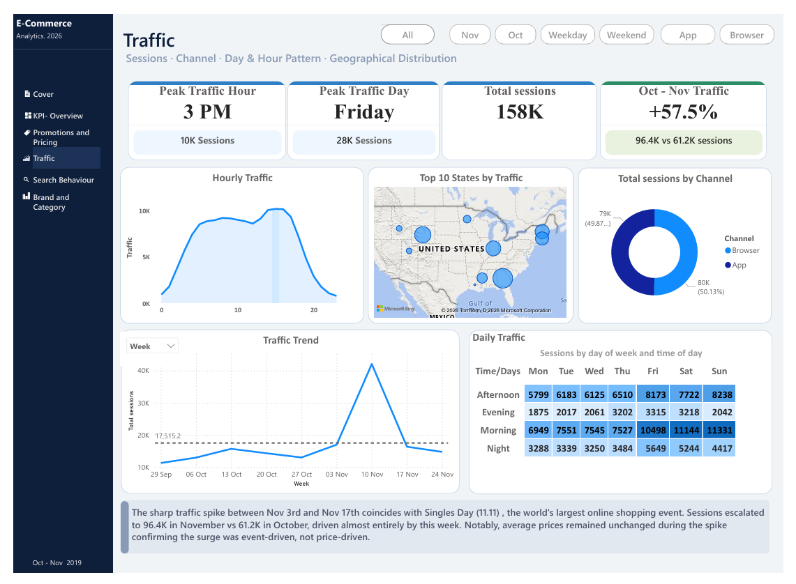

# 🛒 E-Commerce Analytics Power BI Report


> A comprehensive Power BI analytics solution that dissects e-commerce customer behaviour, traffic patterns, pricing dynamics, and brand/category performance — transforming raw event-level data into strategic business intelligence.

---

## 📋 Table of Contents

1. [Executive Summary](#executive-summary)
2. [Objective](#objective)
3. [Dataset Description](#dataset-description)
4. [Data Model](#data-model)
5. [Dashboard Pages](#dashboard-pages)
   - [Cover Page](#1-cover-page)
   - [KPI Overview](#2-kpi-overview)
   - [Traffic Analysis](#3-traffic-analysis)
   - [Pricing & Promotions](#4-pricing--promotions)
   - [Search & Customer Behaviour](#5-search--customer-behaviour)
   - [Brand & Category Performance](#6-brand--category-performance)
6. [How to Use the Report](#how-to-use-the-report)
7. [Download & Setup](#download--setup)

---

## Executive Summary

This Power BI report analyses **160,000 customer interaction events** across an e-commerce platform to uncover actionable insights across five key business dimensions: overall KPI health, site traffic, promotional effectiveness, search behaviour, and brand/category performance.

**Headline findings:**

- 💰 **$5.65M** total revenue generated across the analysis period
- 👥 **144K unique users** with a **9.24% overall conversion rate**
- ⏰ Peak traffic occurs at **3 PM on Fridays**, with sessions spiking **+57.5%** above average
- 📣 Promotional campaigns drive a **18.62% conversion rate** vs. only **5.9%** for non-promoted products
- 📱 **Apple** leads revenue at ~$3.1M; **Electronics** is the top category at ~$4.9M
- 🔍 **Samsung** is the most-searched brand (22.14%); **Electronics** is the most-browsed category (65.07%)

---

## Objective

The goal of this project is to analyse e-commerce platform data and answer critical business questions around customer acquisition, engagement, and conversion. The report is designed to support data-driven decisions for:

- **Marketing teams** — understanding which channels, time slots, and promotions drive the most conversions
- **Merchandising teams** — identifying top-performing brands, categories, and price tiers
- **Product teams** — evaluating search behaviour, cart abandonment, and funnel drop-offs
- **Leadership** — monitoring KPIs and revenue performance at a glance

**Key business questions answered:**
1. What is the overall conversion rate and how do KPIs trend over time?
2. When do users visit the platform, and from where?
3. Which promotional strategies are most effective — and at what discount levels?
4. What are customers searching for, and does it align with purchasing behaviour?
5. Which brands and product categories generate the most revenue?

---

## Dataset Description

The analysis is built on two datasets stored in the `/Dataset` folder of this repository.

---

### 📦 Sales_Data_Ecommerce.csv

The primary fact dataset capturing every customer interaction event on the platform. It contains **160,000 rows** and **18 columns**, representing event-level granularity — each row is a single customer action (view, add-to-cart, or purchase).

| Column | Description |
|---|---|
| `user_id` | Unique identifier for each customer |
| `event_date` | Date the event occurred |
| `Day_of_Week` | Day name (Monday–Sunday) |
| `Channel` | Acquisition channel (Organic, Paid, Social, etc.) |
| `event_time` | Timestamp of the event |
| `event_hour` | Hour of the event (0–23) |
| `event_timezone` | Timezone of the event |
| `event_type` | Type of action: `view`, `cart`, or `purchase` |
| `product_id` | Unique product identifier |
| `category_id` | Numeric category identifier |
| `category` | Top-level product category (e.g., Electronics) |
| `sub_category1` | First-level sub-category |
| `sub_category2` | Second-level sub-category |
| `brand` | Brand name of the product |
| `price` | Product price at time of event |
| `user_session` | Session identifier linking events within a browsing session |
| `State` | Indian state from which the user accessed the platform |
| `User_Score` | Behavioural score assigned to each user |

> **Scale:** 160,000 events | 18 attributes | Event-level granularity

---

### 🏷️ Promotion.csv.xlsx

A supplementary dimension dataset capturing promotional campaigns applied to specific products on specific dates. It contains **61 rows** and **4 columns**.

| Column | Description |
|---|---|
| `Promotion Id` | Unique identifier for the promotion campaign |
| `Date` | The date on which the promotion was active |
| `Discount` | Discount percentage applied (e.g., 0.10 = 10%) |
| `ProductId` | The product to which the promotion applies |

> **Scale:** 61 promotion records | 4 attributes | Product-date level granularity

---

## Data Model

The report is built on a **Star Schema**, with the `Sales_Data_Ecommerce` table acting as the central **fact table** and supporting tables serving as **dimension tables**.

```
                    ┌─────────────────────┐
                    │   Date (Dimension)  │
                    │  - Date             │
                    │  - Month, Year etc. │
                    └────────┬────────────┘
                             │ 1
                             │
                             │ *
          ┌──────────────────▼──────────────────────┐
          │       Sales_Data_Ecommerce (Fact)        │
          │  - user_id, event_date, event_type       │
          │  - product_id, brand, category, price    │
          │  - Channel, State, User_Score            │
          └──────────┬───────────────────────────────┘
                     │ *
                     │
                     │ 1
          ┌──────────▼──────────────────────┐
          │   Promotion Dataset (Dimension) │
          │  - Promotion Id                 │
          │  - Date                         │
          │  - Discount                     │
          │  - ProductId                    │
          └─────────────────────────────────┘
```

### 🔑 Relationship & Composite Key

A key modelling challenge arose during development: the `Promotion Dataset` could not be linked to the fact table via a simple `Promotion Id` foreign key, because **the Promotion Id column was not present in the fact table** (`Sales_Data_Ecommerce`).

To resolve this, a **composite key** was engineered by concatenating `ProductId` and `Date` in the Promotions table:

```
Composite Key = ProductId & Date
```

This composite key uniquely identifies each promotion record and allows a reliable **one-to-many relationship** between the Promotions dimension and the fact table — where one product-date promotion maps to many individual purchase events on that date.


### Field Parameters & Measures

In addition to the core tables, the data model includes:

| Object | Type | Purpose |
|---|---|---|
| `Date` | Dimension Table | Calendar intelligence and time-based filtering |
| `Time` | Field Parameter | Dynamic axis switching for time-based visuals |
| `Categories` | Field Parameter | Toggle between category levels in visuals |
| `Parameter` | Field Parameter | General-purpose dynamic field selector |
| `KPIs` | Calculated Measures Table | Central repository for all DAX measures (Revenue, Conversion Rate, AOV, etc.) |

---

## Dashboard Pages

### 1. Cover Page

**The report's landing page**, designed as an executive entry point with instant visibility into top-line metrics.



**What it shows:**
- Navigation panel to jump to any report section
- Spotlight KPI callouts for the most strategically significant metrics:
  - 🍎 **Apple** — ~$3.1M in revenue (top brand)
  - 📱 **Electronics** — ~$4.9M in revenue (top category)
  - 👀 **Samsung** — ~28K views (most viewed brand)
  - 🛒 **9.24%** overall conversion rate

**Purpose:** Provides leadership with an immediate snapshot of the platform's commercial health before drilling into deeper analysis.

---

### 2. KPI Overview

**The command centre of the report**, consolidating all primary performance indicators and macro trends.


**Metrics displayed:**

| KPI | Value |
|---|---|
| Total Revenue | $5.65M |
| Average Order Value (AOV) | $387.60 |
| Total Events | 160K |
| Unique Users | 144K |
| Conversion Rate | 9.24% |
| Cart Abandonment Rate | 24.19% |

**Visuals included:**
- **Revenue by Category** — breakdown of revenue contribution by product category
- **Conversion Funnel** — View → Cart → Purchase drop-off visualisation
- **Users by Acquisition Channel** — how customers are reaching the platform
- **Top Brands** — highest-revenue brands ranked
- **Top States Map** — geographical distribution of purchasing users across India

**Purpose:** Answers "How is the business performing overall?" and identifies whether the funnel is healthy or leaking at specific stages.

---

### 3. Traffic Analysis

**A deep-dive into when, where, and how users arrive at the platform.**



**Key findings visualised:**

| Insight | Detail |
|---|---|
| Peak Hour | 3 PM |
| Peak Day | Friday |
| Max Sessions | 158K (+57.5% Spike in November) |

**Visuals included:**
- **Hourly Traffic Chart** — session volume across each hour of the day
- **Daily Traffic Heatmap** — day × hour matrix showing intensity of site activity
- **Traffic Trend** — longitudinal view of sessions over the analysis period
- **Top 10 States** — states contributing the most traffic
- **Sessions by Acquisition Channel** — channel-level traffic breakdown

**Purpose:** Enables marketing teams to optimise ad scheduling, content publishing, and server capacity around peak demand windows. The Friday 3 PM spike is a clear opportunity for targeted promotions.

---

### 4. Pricing & Promotions

**An analysis of promotional campaign effectiveness and pricing strategy impact on conversions.**


**Key findings:**

| Metric | Value |
|---|---|
| Average Price of Promoted Products | $389.8 |
| Promoted Purchase Events | 294 |
| Average Discount Applied | 13.72% |
| Promoted Conversion Rate | **18.62%** |

**Visuals included:**
- **Price Variation Chart** — distribution of product prices and how they relate to conversion
- **Promotion Impact Table** — product-level breakdown of promoted vs. non-promoted performance
- **Discount vs. Conversion** — relationship between discount depth and conversion uplift

**Purpose:** Quantifies the ROI of promotional activity. The data shows promotions deliver a **3× conversion lift** over non-promoted products — a compelling case for strategic discounting, though one that must be balanced against margin impact.

---

### 5. Search & Customer Behaviour

**An exploration of what customers search for, browse, and how their discovery patterns connect to purchasing decisions.**


**Key findings:**

| Behaviour Metric | Value |
|---|---|
| Most Searched Brand | Samsung (22.14%) |
| Most Browsed Category | Electronics (65.07%) |
| Single-Category Browsers | 114K users |
| Avg. Product Views per User | 1.09 |

**Visuals included:**
- **Brand × Category Cross-Search Matrix** — reveals which brands are searched within each category
- **Sub-Category Treemap** — visualises the relative volume of browsing across sub-categories
- **Search vs. Conversion Bubble Chart** — plots brand search volume against actual conversion, exposing gaps between interest and purchase
- **Single vs. Multi-Category Browsers** — user segmentation by browsing breadth

**Purpose:** Bridges the gap between discovery and conversion. The data reveals Samsung drives the most search interest yet Electronics as a whole dominates browsing — suggesting category-level promotions may outperform brand-level targeting for broad reach.

---

### 6. Brand & Category Performance

**A granular breakdown of revenue and funnel performance by brand and product category.**


**Visuals included:**
- **Top Brands Revenue Ranking** — Apple, Samsung, Xiaomi and others ranked by revenue contribution
- **Brand Funnel (View → Cart → Purchase)** — funnel visualisation for the top brands to identify drop-off points
- **Category Funnel (View → Cart → Purchase)** — same funnel breakdown at the category level
- **Products by Price Group** — distribution of SKUs across price tiers (budget, mid-range, premium)
- **Revenue by Sub-Category** — granular revenue breakdown below the top-level category

**Purpose:** Provides merchandising and commercial teams with the data needed to make stocking, pricing, and promotional decisions. Apple's dominance in revenue versus Samsung's dominance in search signals a potential upsell opportunity for Samsung products.

---

## How to Use the Report

### Navigation
The report features a **navigation panel on the Cover Page**. Click any section title to jump directly to that page. Each page also contains back navigation to return to the Cover.

### Slicers & Filters
Each page is equipped with interactive slicers. You can filter the entire page by:
- **Date range** — analyse specific time periods
- **Weekday / Weekend** — have a comparative Distinction in sales
- **Brand** — No separate slicer, Visual level slicer is present
- **Channel** — compare acquisition sources
- **State** — regional analysis

### Field Parameters
Several visuals use **dynamic field parameters**, allowing you to switch the axis dimension without changing the visual. Look for dropdown controls above charts labelled `Time`, `Categories`, or `Parameter` to toggle between dimensions.

---

## Download & Setup

### Prerequisites
- **Power BI Desktop** (free) — [Download here](https://powerbi.microsoft.com/en-us/desktop/)
- Windows 10 or later

### Steps to Open the Report

1. **Clone or download this repository:**
   ```
   git clone https://github.com/Anandukaran/powerbi-ecommerce-analysis.git
   ```
   Or click **Code → Download ZIP** on the repository page.

2. **Navigate to the `Main Files` folder** inside the downloaded repository.

3. **Open** `E - commerce case study.pbix` **with Power BI Desktop.**

4. The report will load with all visuals and data pre-loaded. No additional data connection setup is required — the datasets are embedded within the `.pbix` file.

5. *(Optional)* If you wish to refresh with updated data, replace the CSV files in the `Dataset` folder and use **Home → Transform Data → Refresh** in Power BI Desktop.

### File Reference

| File | Location | Description |
|---|---|---|
| `E - commerce case study.pbix` | `/Main Files/` | Power BI report file (open with Power BI Desktop) |
| `E - Commerce Case study.pdf` | `/Main Files/` | Original case study brief and business questions |
| `Sales_Data_Ecommerce.csv` | `/Dataset/` | Primary fact dataset (160K events) |
| `Promotion.csv.xlsx` | `/Dataset/` | Promotions dimension dataset (61 records) |
| Dashboard Screenshots | `/Images/` | PNG exports of all report pages |

---

<div align="center">

**Built with ❤️ using Power BI Desktop**

[⬆ Back to Top](#-e-commerce-analytics-dashboard--power-bi)

</div>
